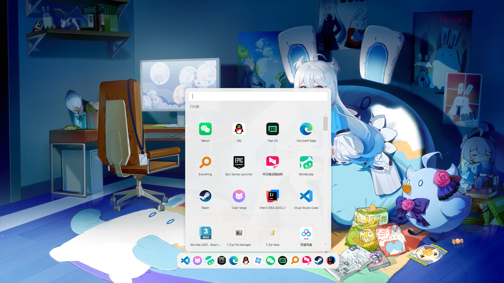
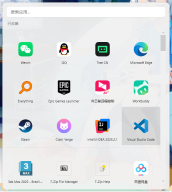
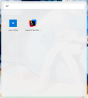
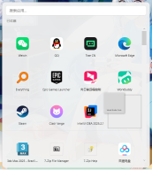
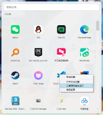
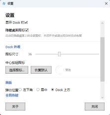

# DesktopBeautify（桌面美化）

> Windows11 桌面美化与效率工具。傻瓜式使用，无需额外配置，类win10开始栏磁贴。


**当前版本：v0.1.0**（首个预览版）

---

## 功能介绍

### 应用启动器
- **应用索引** —— 自动扫描「开始菜单（用户级 + 系统级）」并补全 UWP / 商店应用，合并去重，全量覆盖
- **模糊搜索** —— 支持名称、中文拼音全拼与首字母匹配，有输入按相关度、无输入按使用频率排序
- **图标网格** —— 提取 256px 高清图标并本地缓存（LRU），常用应用以图标网格呈现
- **收藏固定** —— 把常用应用钉在面板上，支持拖拽排序
- **任务栏锚定** —— 面板从任务栏边缘弹出，适配多屏与不同任务栏位置
- **两种唤起** —— 点击任务栏图标，或启用全局热键（`Ctrl+Alt+Space`，可选，默认关闭）


### 常驻 Dock 栏
- 桌面底部常驻的透明 Dock
- 中心按钮点击展开 / 收起搜索面板
- 收藏应用左右对称排布，悬浮放大


### 面板磁贴右键菜单
- **收藏 / 取消收藏**
- **打开文件位置** —— `explorer /select` 定位到程序所在目录（UWP 无实体文件时自动禁用）
- **以管理员身份运行** —— 走 UAC 提权（UWP 无 exe 时自动禁用）
- **移到前面** —— 已收藏项一键置顶，并联动刷新 Dock 顺序






### 桌面图标管理（F18）
- 一键隐藏 / 显示桌面图标，走系统官方 API（与右键「显示桌面图标」同源）
- 仅自动恢复「本程序隐藏」的图标，尊重你在系统右键菜单里的手动设置，不打架

### 设置页
- 隐藏桌面图标开关
- 开机自启
- Dock 图标尺寸调节（24–56）
- 中心按钮自定义图标 + 裁剪


---

## 打包与构建

### 环境要求
- **构建机**：Windows 10 / 11 x64 + [.NET 8 SDK](https://dotnet.microsoft.com/download)
- **目标机**：Windows 10 / 11 x64（发布为自包含包，**无需安装 .NET**）

### 一键打包（自包含发布）
在**仓库根目录**执行：

```powershell
.\package.ps1
```

脚本会：
1. `dotnet publish -c Release -r win-x64 --self-contained true` 发布
2. 把 `LICENSE` 与 `THIRD-PARTY-NOTICES.md` 一并打进包（开源合规）
3. 压缩为 `Output/DesktopBeautify-v0.1.0.zip`（内容置根，**解压即运行**）

> 发版改版本号：编辑 `package.ps1` 顶部的 `$Version` 变量即可。

### 本地调试运行
```bash
dotnet run --project src/Launcher.App
```

### 手动发布（等价于 package.ps1 的核心步骤）
```bash
dotnet publish src/Launcher.App/Launcher.App.csproj -c Release -r win-x64 --self-contained true -o Output/.publish-tmp
# 将 Output/.publish-tmp 的内容压缩为 zip，并连同 LICENSE、THIRD-PARTY-NOTICES.md 一起放入
```

---

## 当前版本

| 版本 | 日期 | 说明 |
| --- | --- | --- |
| **v0.1.0** | 2026-09 | 首个预览版：应用启动器 + 常驻 Dock 栏 + 桌面图标隐藏 + 设置页|

---

## 打赏

如果这个工具对你有帮助，欢迎请作者喝杯咖啡 ☕


---

## 开源声明

本项目以 [Apache-2.0](LICENSE) 许可证开源。所引用的第三方依赖（Vanara、CommunityToolkit.Mvvm 等）**均为 MIT 许可证**，完整清单与版权信息见 [THIRD-PARTY-NOTICES.md](THIRD-PARTY-NOTICES.md)。

## 许可证

[Apache License 2.0](LICENSE)
